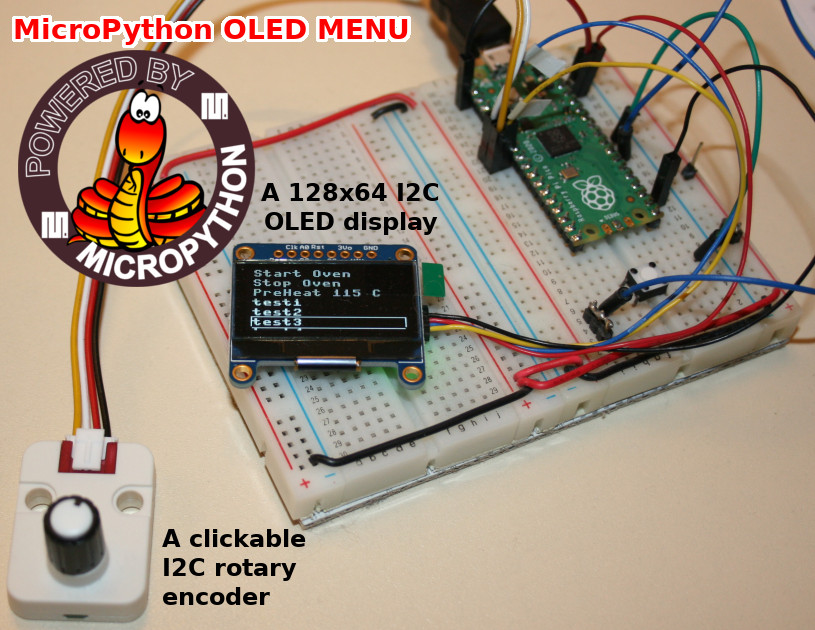
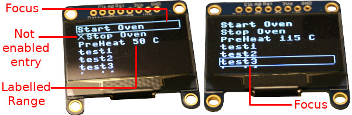
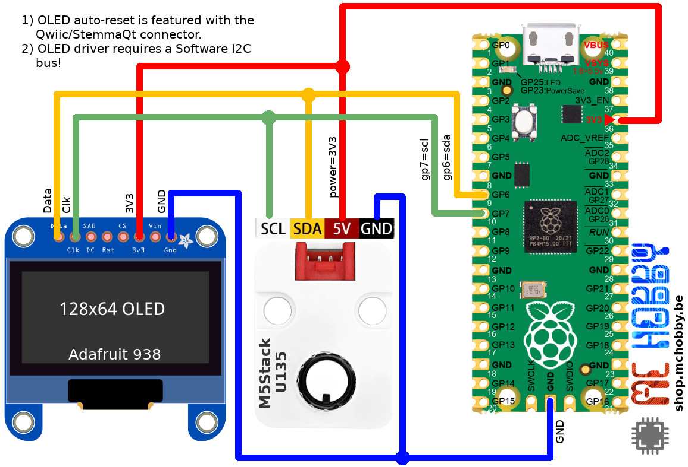

# OLED MENU for MicroPython

__Project currently under development__

The aim of this project is to create an easy-to-control MicroPython system based on a 128 x 64 OLED screen and a clickable rotary encoder.



## Features



* __Not blocking__ by design
* One level with unlimited entries
* Updatable at runtime (eg: changing label)
* Focus (surrounding rectangle entry) moved by rotating the encoder
* Focused entry is selected by clicking the encoder
* Inverted effect on entry when clicked (750ms, not blocking)
* Button click debouncing
* Enable property (avoids selection of disabled entries)
* Various type of menu items:
	* Label only
	* Range : allowing to change an integer throught a range of values)
	* Screen  : allow the main app to display/draw its own screen until the user press the button (display back the menu)


# Library

```
mpremote mip install github:mchobby/esp8266-upy/oled-ssd1306
mpremote mip install github:mchobby/esp8266-upy/m5stack-u135
mpremote mip install github:mchobby/esp8266-upy/FBGFX
```

# Wiring

# Raspberry-Pi Pico
This wiring use [Monochrome 1.3" 128x64 OLED graphic display - STEMMA QT / Qwiic](https://www.adafruit.com/product/938) and [Encodeur + LED RGB, Grove](https://shop.m5stack.com/products/encoder-unit) from M5Stack.



# Testing

## test.py - simple example

This example shows how to define a menu and how to navigate the menu, update an
integer value (see _preheat_).

Finally, it implement the main loop program loop (_while_) including Update
of menu, test of selected entry and processing of the user tasks.


``` python
from machine import SoftI2C, Pin
from oledmenu import *

# Oled display requires a SoftI2C to work properly
i2c = SoftI2C(sda=Pin(6), scl=Pin(7)) # I2C(1) : GP6=SDA, GP7=SCL

menu = OLED_MENU( i2c );

# code, Label
menu.add_label( "start", "Start Oven" )
menu.add_label( "stop" , "Stop Oven" , enabled=False )
menu.add_range( "preheat" , "PreHeat %s C", 25, 180, 5, 50 ) # Min, Max, Step, default
menu.add_label( "t1", "test1" ) # code, Label
menu.add_label( "t2", "test2" ) # code, Label
menu.add_label( "t3", "test3" ) # code, Label
menu.add_label( "t4", "test4" ) # code, Label
menu.add_label( "t5", "test5" ) # code, Label
menu.add_label( "t6", "test6" ) # code, Label
menu.add_label( "t7", "test7" ) # code, Label
menu.add_label( "t8", "test8" ) # code, Label

# initialize the menu
menu.start()

while True:
	if menu.update(): # true when entry selected
		entry = menu.selected # will reset selection
		if entry:
			print( "%s selected" % entry )

		# Enable entry "Stop Oven" when "test3" is clicked
		if entry and entry.code=="t3":
			menu.by_code("stop").enabled=True
```

Which produce the follwoing result in the REPL session while selecting the various menu entries.

```
<preheat "PreHeat 50 C"> selected
<preheat "PreHeat 115 C"> selected
<t1 "test1"> selected
<t2 "test2"> selected
<t3 "test3"> selected
```

# Supported devices

* Adafruit OLED Display 128 x 64 pixels (ADF 938)
	* [Monochrome 1.3" 128x64 OLED graphic display - STEMMA QT / Qwiic](https://shop.mchobby.be/product.php?id_product=307) @ MC Hobby
	* [Monochrome 1.3" 128x64 OLED graphic display - STEMMA QT / Qwiic](https://www.adafruit.com/product/938) @ Adafruit
* M5Stack I2C Rotary Encoder (U135)
	* [M5Stack : Encodeur + LED RGB, Grove](https://shop.mchobby.be/product.php?id_product=2456) @ MC Hobby
	* [M5Stack : Encodeur + LED RGB, Grove](https://shop.m5stack.com/products/encoder-unit) @ M5Stack
